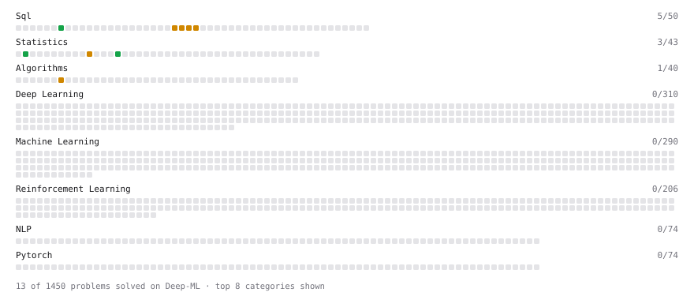

# Deep-ML

My machine learning practice from [Deep-ML](https://www.deep-ml.com). Every solution here was written by hand.

**23** solved · 22 problems · 1 labs · 0 math

[**Browse the interactive portfolio**](https://everettmakes.github.io/deep-ml/) to replay this filling in over time.

## Problems

| | Difficulty | Solved | |
| --- | --- | --- | --- |
| [Count rows per group](https://www.deep-ml.com/problems/1107) | easy | 2026-09-23 | [solution](problems/1107-count-rows-per-group) |
| [Descriptive Statistics Calculator](https://www.deep-ml.com/problems/78) | easy | 2026-09-23 | [solution](problems/0078-descriptive-statistics-calculator) |
| [Detect Overfitting or Underfitting](https://www.deep-ml.com/problems/86) | easy | 2026-09-24 | [solution](problems/0086-detect-overfitting-or-underfitting) |
| [Feature Scaling Implementation](https://www.deep-ml.com/problems/16) | easy | 2026-09-25 | [solution](problems/0016-feature-scaling-implementation) |
| [Generate Normal Samples and Compute Histogram Counts](https://www.deep-ml.com/problems/1130) | easy | 2026-09-24 | [solution](problems/1130-generate-normal-samples-and-compute-histogram-counts) |
| [Handle Missing Data in pandas (dropna/fillna)](https://www.deep-ml.com/problems/1128) | easy | 2026-09-23 | [solution](problems/1128-handle-missing-data-in-pandas-dropna-fillna) |
| [Min-Max Scaling of Feature Values](https://www.deep-ml.com/problems/112) | easy | 2026-09-25 | [solution](problems/0112-min-max-scaling-of-feature-values) |
| [Bias-Variance Decomposition from Bootstrap](https://www.deep-ml.com/problems/804) | medium | 2026-09-24 | [solution](problems/0804-bias-variance-decomposition-from-bootstrap) |
| [Clean a Messy Dataset: Dedup, Standardize, Impute](https://www.deep-ml.com/problems/1131) | medium | 2026-09-24 | [solution](problems/1131-clean-a-messy-dataset-dedup-standardize-impute) |
| [Efficiently Find Duplicates in a Large Dataset](https://www.deep-ml.com/problems/1089) | medium | 2026-09-24 | [solution](problems/1089-efficiently-find-duplicates-in-a-large-dataset) |
| [Employees Earning Above Their Department Average (Correlated Subquery)](https://www.deep-ml.com/problems/1126) | medium | 2026-09-23 | [solution](problems/1126-employees-earning-above-their-department-average-correlated-subquery) |
| [Filter, Group, and Aggregate a DataFrame (Top-10 by Metric)](https://www.deep-ml.com/problems/1127) | medium | 2026-09-23 | [solution](problems/1127-filter-group-and-aggregate-a-dataframe-top-10-by-metric) |
| [Implement Lasso Regression using ISTA](https://www.deep-ml.com/problems/50) | medium | 2026-09-25 | [solution](problems/0050-implement-lasso-regression-using-ista) |
| [Implement Stratified K-Fold Cross-Validation](https://www.deep-ml.com/problems/840) | medium | 2026-09-25 | [solution](problems/0840-implement-stratified-k-fold-cross-validation) |
| [Learning Curve Generator for Bias-Variance Diagnosis](https://www.deep-ml.com/problems/800) | medium | 2026-09-24 | [solution](problems/0800-learning-curve-generator-for-bias-variance-diagnosis) |
| [Maximum Likelihood Estimation for Gaussian Distribution](https://www.deep-ml.com/problems/337) | medium | 2026-09-23 | [solution](problems/0337-maximum-likelihood-estimation-for-gaussian-distribution) |
| [Merge Multiple DataFrames](https://www.deep-ml.com/problems/1129) | medium | 2026-09-23 | [solution](problems/1129-merge-multiple-dataframes) |
| [Reshape Data with pivot_table and melt](https://www.deep-ml.com/problems/1132) | medium | 2026-09-24 | [solution](problems/1132-reshape-data-with-pivot-table-and-melt) |
| [Salary Difference Between Departments with Conditional Aggregation](https://www.deep-ml.com/problems/1124) | medium | 2026-09-23 | [solution](problems/1124-salary-difference-between-departments-with-conditional-aggregation) |
| [StandardScaler Fit and Transform](https://www.deep-ml.com/problems/842) | medium | 2026-09-25 | [solution](problems/0842-standardscaler-fit-and-transform) |
| [Top-N Most Profitable Companies with DENSE_RANK](https://www.deep-ml.com/problems/1123) | medium | 2026-09-23 | [solution](problems/1123-top-n-most-profitable-companies-with-dense-rank) |
| [Top-N Percent by Group with NTILE](https://www.deep-ml.com/problems/1125) | medium | 2026-09-23 | [solution](problems/1125-top-n-percent-by-group-with-ntile) |

## Labs

| | Difficulty | Solved | |
| --- | --- | --- | --- |
| [Fix Overfitting with Regularization (NumPy)](https://www.deep-ml.com/labs/21) | medium | 2026-09-24 | [solution](labs/0021-fix-overfitting-with-regularization-numpy) |

---

_This file is regenerated by Deep-ML on every push._
